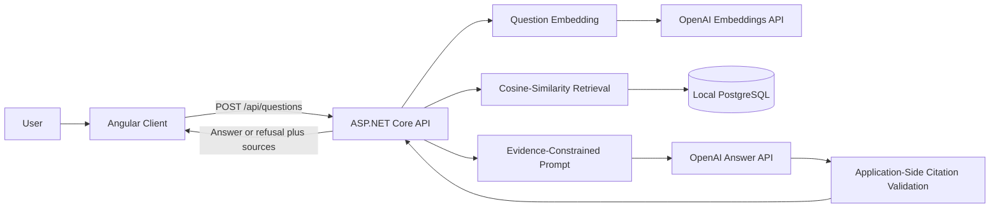

# CaseLens Mini

CaseLens Mini is a citation-grounded legal research demonstration built with ASP.NET Core, Angular, PostgreSQL, and the OpenAI API. It answers questions only from a fixed collection of three public United States Supreme Court opinions, retrieves relevant passages using cosine similarity in C#, and displays the exact evidence supporting each answer. When the indexed material does not provide enough support, CaseLens is designed to decline rather than invent an answer.

> **Research demonstration only:** CaseLens is an educational portfolio project. It is not a legal research product, does not provide legal advice, and should not be relied upon for legal decisions.

## Demo Screenshot

Add a screenshot of the completed browser page at:

```text
docs/caselens-demo.png
```

Then keep the following image reference:


## Indexed Collection

CaseLens searches only these three public Supreme Court opinions:

- **Terry v. Ohio**, 392 U.S. 1 (1968)
- **Graham v. Connor**, 490 U.S. 386 (1989)
- **Arizona v. Gant**, 556 U.S. 332 (2009)

The collection is intentionally small so the project can focus on retrieval quality, evidence traceability, citation validation, refusal behavior, and clear engineering tradeoffs.

## Core Capabilities

- Extracts text from the three opinion PDFs page by page.
- Creates deterministic, page-aware text chunks.
- Generates and stores OpenAI embeddings for each chunk.
- Stores document metadata, text, page numbers, and embeddings in PostgreSQL.
- Calculates cosine similarity in the ASP.NET Core process.
- Retrieves the most relevant passages for a question.
- Sends only retrieved passages to the answer-generation model.
- Assigns citation IDs such as `C1`, `C2`, and `C3` in application code.
- Rejects model-generated citation IDs that do not correspond to retrieved evidence.
- Displays the opinion, legal citation, page, passage, and similarity score.
- Uses an insufficient-evidence response when the collection cannot support an answer.

## Architecture



### Request Flow

1. The Angular client sends a question to `POST /api/questions`.
2. The API generates an embedding for the question.
3. The retrieval service loads the small embedded corpus from PostgreSQL.
4. C# calculates cosine similarity between the question vector and each stored chunk vector.
5. The API selects the highest-scoring chunks above the configured threshold.
6. The application assigns controlled evidence IDs such as `C1` through `C5`.
7. The answer model receives only the question and retrieved evidence.
8. The model returns structured answer text, citation IDs, and an insufficient-evidence flag.
9. The API removes unknown or invalid citation IDs.
10. The Angular page displays the answer or refusal and the validated source passages.

## Technology Stack

### Backend

- C#
- .NET 10
- ASP.NET Core Web API
- Entity Framework Core
- Npgsql
- PdfPig
- xUnit

### Frontend

- Angular
- TypeScript
- SCSS

### Data and AI

- Local PostgreSQL
- PostgreSQL `real[]` columns for vectors
- OpenAI embedding API
- OpenAI answer-generation API
- In-process cosine-similarity ranking

## Repository Structure

```text
CaseLens-Mini/
|-- CaseLensMini.slnx
|-- README.md
|-- PROJECT_BRIEF.md
|-- ARCHITECTURE.md
|-- PROGRESS.md
|-- src/
|   |-- CaseLens.Api/
|   `-- caselens-client/
`-- tests/
    `-- CaseLens.Api.Tests/
```

## Prerequisites

Install the following before running CaseLens:

- Git
- .NET 10 SDK
- PostgreSQL
- pgAdmin or another PostgreSQL administration tool
- Node.js and npm
- An OpenAI API key

Confirm the main tools are available:

```powershell
git --version
dotnet --version
psql --version
node --version
npm --version
```

## Initial Setup

### 1. Clone the repository

```powershell
git clone https://github.com/rayheinzelman/CaseLens-Mini.git
cd CaseLens-Mini
git checkout dev
```

### 2. Create the PostgreSQL databases

Create two local databases:

```text
caselens
caselens_test
```

The test database is kept separate so integration tests do not alter development data.

Example development connection string:

```text
Host=localhost;Port=5432;Database=caselens;Username=postgres;Password=<your-password>
```

Example test connection string:

```text
Host=localhost;Port=5432;Database=caselens_test;Username=postgres;Password=<your-password>
```

### 3. Configure user secrets

Secrets must not be added to `appsettings.json` or committed to Git.

Set the development database connection:

```powershell
dotnet user-secrets set "ConnectionStrings:CaseLensDatabase" "Host=localhost;Port=5432;Database=caselens;Username=postgres;Password=<your-password>" --project src/CaseLens.Api
```

Set the test database connection:

```powershell
dotnet user-secrets set "ConnectionStrings:CaseLensTestDatabase" "Host=localhost;Port=5432;Database=caselens_test;Username=postgres;Password=<your-password>" --project tests/CaseLens.Api.Tests
```

Set the OpenAI key used for embeddings:

```powershell
dotnet user-secrets set "OpenAI:Embeddings:ApiKey" "<your-api-key>" --project src/CaseLens.Api
```

Set the OpenAI key used for grounded answer generation:

```powershell
dotnet user-secrets set "OpenAI:Answers:ApiKey" "<your-api-key>" --project src/CaseLens.Api
```

The same OpenAI key may be used for both settings.

To inspect the configured API secrets:

```powershell
dotnet user-secrets list --project src/CaseLens.Api
```

Do not paste the output into issues, screenshots, logs, or commits.

## Database Migration

Restore dependencies and build the solution:

```powershell
dotnet restore CaseLensMini.slnx
dotnet build CaseLensMini.slnx
```

Apply the Entity Framework Core migration:

```powershell
dotnet ef database update --project src/CaseLens.Api --startup-project src/CaseLens.Api
```

After the migration, PostgreSQL should contain:

```text
legal_documents
document_chunks
```

Each document chunk stores:

- Its parent document ID
- Page number
- Stable chunk index
- Extracted text
- Embedding vector
- Creation timestamp

## Ingest and Embed the Opinions

The three PDFs are included in the API opinion data directory.

Run the ingestion command from the repository root:

```powershell
dotnet run --project src/CaseLens.Api -- --ingest
```

This command:

1. Reads the three opinion PDFs.
2. Extracts text by page.
3. Creates deterministic chunks.
4. Stores document and chunk records in PostgreSQL.
5. Generates embeddings for chunks whose vectors are null or empty.
6. Skips previously embedded chunks when rerun.

The process is resumable. If embedding generation stops partway through, rerunning the command generates only missing vectors.

### Verify stored embeddings

Run the following query in pgAdmin or `psql`:

```sql
SELECT
    COUNT(*) AS total_chunks,
    COUNT(embedding) AS embedded_chunks,
    MIN(cardinality(embedding)) AS minimum_dimensions,
    MAX(cardinality(embedding)) AS maximum_dimensions
FROM document_chunks;
```

A successful result has:

- Equal `total_chunks` and `embedded_chunks`
- `minimum_dimensions` equal to `1536`
- `maximum_dimensions` equal to `1536`

## Run the Application

The backend and frontend run as separate local processes.

### Terminal 1: Start the API

From the repository root:

```powershell
dotnet run --project src/CaseLens.Api
```

Use the local HTTPS or HTTP address printed by ASP.NET Core.

### Terminal 2: Start Angular

```powershell
cd src/caselens-client
npm ci
npm start
```

Open:

```text
http://localhost:4200
```

The Angular development proxy forwards question requests to the local API.

## Example Questions

### Supported: stop and frisk

```text
When may police stop and frisk a person based on reasonable suspicion?
```

Expected opinion:

```text
Terry v. Ohio
```

Expected concept:

```text
The officer must rely on specific and articulable facts supporting reasonable suspicion rather than an unparticularized suspicion or hunch.
```

### Supported: excessive force

```text
What standard governs whether police used excessive force during an arrest?
```

Expected opinion:

```text
Graham v. Connor
```

Expected concept:

```text
Excessive-force claims are evaluated under the Fourth Amendment's objective-reasonableness standard from the perspective of a reasonable officer on the scene.
```

### Supported: vehicle search after arrest

```text
When may police search a vehicle incident to the arrest of a recent occupant?
```

Expected opinion:

```text
Arizona v. Gant
```

Expected concept:

```text
A vehicle search incident to arrest is limited to circumstances in which the arrestee could access the passenger compartment or it is reasonable to believe that the vehicle contains evidence of the offense of arrest.
```

### Unsupported

```text
How should I draft my apartment lease?
```

Expected behavior:

```text
CaseLens declines because the indexed opinions do not provide evidence about lease drafting.
```

## Development Retrieval Endpoint

In the development environment, retrieval can be inspected without invoking the answer-generation model.

```http
POST /api/development/retrieval
Content-Type: application/json
```

Example body:

```json
{
  "question": "What facts must support a stop and frisk?"
}
```

The endpoint returns ranked chunks with metadata and similarity scores. It exists to separate retrieval evaluation from answer fluency.

## Run Retrieval Evaluation

Run the repeatable real-corpus retrieval evaluation:

```powershell
dotnet run --project src/CaseLens.Api -- --evaluate-retrieval
```

The command checks whether the expected opinion appears in the top retrieval results for questions covering:

- Stop and frisk
- Excessive force
- Vehicle searches incident to arrest

A failed expected-source check causes the evaluation process to exit unsuccessfully.

## Evaluation Results

The evaluation set tests retrieval quality, citation integrity, answer behavior, and refusal behavior.

| Question | Expected source or behavior | Retrieval hit | Citations valid | Behavior correct |
|---|---|---:|---:|---:|
| When may police stop and frisk a person based on reasonable suspicion? | *Terry v. Ohio*; specific and articulable facts | Yes | Yes | Yes |
| What standard governs whether police used excessive force during an arrest? | *Graham v. Connor*; objective reasonableness | Yes | Yes | Yes |
| When may police search a vehicle incident to the arrest of a recent occupant? | *Arizona v. Gant*; access or evidence-of-offense limits | Yes | Yes | Yes |
| How do the opinions distinguish an officer's authority during a street encounter, an arrest, and a vehicle search? | Relevant passages from the applicable opinions | Yes | Yes | Yes |
| How should I draft my apartment lease? | Refusal because the corpus does not address lease drafting | No expected source | Yes | Yes |
| The police searched my car after arresting me. Was the search illegal, and should I file a lawsuit? | Explain only what *Gant* supports and avoid personalized legal advice | Yes | Yes | No |

### Observed Evaluation Weakness

The final personalized question retrieved relevant evidence from *Arizona v. Gant* and produced an evidence-based explanation of the vehicle-search rule. That part was grounded in the indexed opinion.

However, the response also suggested that the user might have grounds to file a lawsuit. The indexed opinions do not provide enough facts to make that personalized recommendation, and CaseLens is not intended to advise a user whether to bring a legal claim.

This is recorded as a known failure rather than hidden through selective reporting. A production-quality version should distinguish between:

1. A supported request to explain what an opinion says.
2. A request to apply that opinion conclusively to a person's facts.
3. A request for personalized legal advice or a recommended legal action.

The preferred behavior for that question would be to explain the rule supported by *Gant*, state that the available evidence cannot determine whether the specific search was unlawful, and decline to recommend whether the user should file a lawsuit.

## Automated Tests

Run the backend test suite:

```powershell
dotnet test tests/CaseLens.Api.Tests/CaseLens.Api.Tests.csproj
```

The backend tests cover areas including:

- Text normalization and deterministic chunking
- Idempotent document ingestion
- Embedding backfill behavior
- Embedding dimension validation
- Cosine similarity
- Retrieval ordering
- Zero-vector handling
- Evidence-constrained prompt construction
- Citation-ID validation
- Supported answer behavior
- Insufficient-evidence behavior
- Provider-error handling

Run the Angular tests:

```powershell
cd src/caselens-client
npm test -- --run
```

The client tests cover:

- Displaying the fixed opinion collection
- Sending a question to the API
- Rendering a supported answer
- Rendering source evidence
- Rendering an insufficient-evidence result
- Displaying a safe transport-error message

## Production Builds

### Backend

From the repository root:

```powershell
dotnet build CaseLensMini.slnx --configuration Release
```

### Angular

```powershell
cd src/caselens-client
npm ci
npm run build
```

## Reset Demo Data

To clear imported documents and chunks while retaining the schema, run:

```sql
TRUNCATE TABLE document_chunks, legal_documents RESTART IDENTITY CASCADE;
```

Then rerun ingestion and embedding:

```powershell
dotnet run --project src/CaseLens.Api -- --ingest
```

Do not reset the database immediately before an interview unless there is enough time to regenerate all embeddings and verify the application.

## Security Notes

### Secret handling

- Database passwords and OpenAI keys are stored in .NET user secrets.
- Secrets are not stored in tracked configuration.
- Provider failures are converted to generic client-facing errors.
- OpenAI response bodies and API keys should not appear in browser errors or application logs.
- `.gitignore` excludes local secrets, generated output, IDE metadata, and other machine-specific files.

### Input and output boundaries

- The application searches only a fixed, public corpus.
- The answer model receives retrieved passages rather than unrestricted document access.
- Citation identifiers are created by the application.
- The application validates model-returned citation IDs before displaying sources.
- Unknown, duplicate, or ungrounded citation IDs are removed.
- A response without valid supporting citations is treated conservatively.

### Before publishing

Review the repository for accidental secrets or generated files:

```powershell
git status
git diff --check
git grep -n -I -E "sk-[A-Za-z0-9_-]+|Password=|ApiKey"
```

Also review the complete Git history if a secret was ever committed. Removing a secret from the latest commit does not remove it from previous commits; exposed credentials must be revoked and replaced.

## Responsible-AI Design

CaseLens emphasizes evidence visibility instead of presenting model output as inherently trustworthy.

The main controls are:

- **Controlled corpus:** Answers are limited to three known opinions.
- **Evidence-only prompting:** Retrieved passages are the only legal evidence supplied to the model.
- **Inspectable sources:** Users can read the exact supporting passages.
- **Application-controlled citations:** The model cannot create arbitrary valid evidence IDs.
- **Citation validation:** Returned citations must map to evidence retrieved for that request.
- **Conservative failure behavior:** The application can return insufficient evidence instead of guessing.
- **Clear product boundary:** The interface states that the system is a research demonstration and not legal advice.
- **Repeatable evaluation:** Retrieval and behavior are checked against known questions.

These controls reduce risk but do not guarantee legal accuracy.

## Known Limitations

- The corpus contains only three Supreme Court opinions.
- The project does not determine whether an opinion remains good law.
- It does not search statutes, regulations, lower-court decisions, secondary sources, or proprietary legal databases.
- It does not account for jurisdiction, procedural posture, later history, or negative treatment.
- It supports text-based PDFs only and does not perform OCR.
- It does not accept user-uploaded documents.
- It does not implement authentication or multi-user isolation.
- It does not provide conversation history.
- Similarity thresholds were tuned for a tiny fixed evaluation set.
- Pure vector similarity may miss useful exact legal terms.
- In-process ranking loads vectors from the small corpus and is not intended for large collections.
- Model output may still over-apply a supported legal rule to an individual situation.
- Refusal behavior requires further evaluation around mixed questions containing both supported research questions and requests for legal advice.
- Similarity scores indicate vector closeness, not legal authority or certainty.
- The application has not undergone a professional security review.
- The project is a local portfolio demonstration, not a production deployment.

## Why Retrieval Runs in C#

For this small fixed corpus, CaseLens stores embeddings in PostgreSQL `real[]` columns, loads the vectors, and calculates cosine similarity in C#.

This was a deliberate scope decision:

- It avoids Docker and database extensions.
- It makes the similarity calculation easy to inspect and test.
- It keeps the two-day project focused on a complete vertical slice.
- It is sufficient for a collection containing only three opinions.

This approach would not scale well because it requires transferring and comparing every candidate vector in the application process.

## Production Evolution

A production implementation would likely add the following in stages.

### Retrieval and data

- PostgreSQL with `pgvector` or a managed vector-search service
- Approximate nearest-neighbor indexes
- Metadata and jurisdiction filters
- Hybrid lexical and vector retrieval
- Reranking
- Document versioning and processing status
- Background ingestion jobs
- Object storage for source files
- OCR for scanned documents
- Automated citation parsing and normalization

### Legal reliability

- Larger, representative evaluation datasets
- Good-law and later-history checks
- Jurisdiction-aware retrieval
- Authority weighting
- Tests for quotations, pin cites, and conflicting authorities
- Human legal-expert review
- Separate behavior for legal research and personalized-advice requests
- More conservative handling of questions that require facts not present in the corpus

### Platform and security

- Authentication and authorization
- Tenant and document isolation
- Encryption and managed secret storage
- Rate limiting and abuse controls
- Structured telemetry and audit logs
- Content retention and deletion policies
- Provider retry, timeout, and circuit-breaker policies
- Asynchronous document processing
- Automated deployment pipelines
- Cloud-hosted PostgreSQL and application services

### User experience

- Corpus-management workflows
- Search filters
- Source-document navigation
- Passage highlighting
- Feedback collection
- Exportable research results
- Clearer uncertainty and scope indicators

## Two-Minute Interview Demonstration

### 0:00–0:20 — Establish the boundary

> “CaseLens is a small legal RAG demonstration built with ASP.NET Core, Angular, PostgreSQL, and OpenAI. It searches only three public Supreme Court opinions: *Terry v. Ohio*, *Graham v. Connor*, and *Arizona v. Gant*. It is a research demo, not legal advice.”

Point to the visible indexed-opinion list and disclaimer.

### 0:20–0:55 — Ask a supported question

Submit:

```text
When may police stop and frisk a person based on reasonable suspicion?
```

Say:

> “The API embeds the question and calculates cosine similarity in C# against the stored chunk vectors. The answer model receives only the highest-ranked retrieved passages.”

Wait for the answer.

### 0:55–1:20 — Inspect the evidence

Expand one of the source cards.

Point out:

- `Terry v. Ohio`
- The official citation
- Page number
- Application-controlled evidence ID
- Similarity score
- Exact retrieved passage

Say:

> “The application creates the evidence IDs before calling the model. The model may cite only those IDs, and the API validates them before returning the response. That prevents the UI from displaying an invented source.”

### 1:20–1:40 — Demonstrate refusal

Submit:

```text
How should I draft my apartment lease?
```

Say:

> “Lease drafting is outside the indexed collection, so the desired behavior is an explicit insufficient-evidence response rather than an answer based on the model's general knowledge.”

Show that the response does not contain invented legal guidance or source cards.

### 1:40–2:00 — Explain the engineering tradeoff

Say:

> “For this three-document demo, I stored vectors as PostgreSQL arrays and ranked them in process because it kept the implementation transparent and testable without introducing Docker or pgvector. For production scale, I would move ranking into pgvector or managed vector search, add hybrid retrieval and reranking, expand the evaluation set, and introduce stronger legal and security controls. I would not describe this version as production-ready.”

## Interview Discussion Points

### Why use RAG?

The answer needs to be traceable to a controlled document collection. Retrieval gives the model relevant source material while allowing the application to display the evidence used.

### Why not trust citations written by the model?

A model can generate plausible-looking but invalid citation identifiers. CaseLens assigns evidence IDs itself and verifies that every returned ID belongs to the retrieved set for that request.

### Why use embeddings?

Legal questions and opinion text may express the same concept using different words. Embeddings provide semantic matching beyond exact keyword overlap.

### Why keep cosine similarity in the API?

The corpus is intentionally tiny. In-process ranking made the retrieval algorithm transparent, testable, and achievable within the project timebox.

### What is the most important remaining weakness?

The system can retrieve a relevant legal rule but still apply it too confidently to a user's personal facts. Production behavior would need stronger classification and evaluation for requests that combine legal research with personalized advice.

### What would change first for production?

The first priorities would be:

1. A representative legal evaluation set
2. Stronger refusal and uncertainty behavior
3. Hybrid retrieval and reranking
4. Scalable vector search
5. Good-law and jurisdiction controls
6. Authentication, tenant isolation, monitoring, and auditability

## Final Verification Checklist

Run these commands before demonstrating the project:

```powershell
dotnet build CaseLensMini.slnx --configuration Release
dotnet test tests/CaseLens.Api.Tests/CaseLens.Api.Tests.csproj
dotnet run --project src/CaseLens.Api -- --evaluate-retrieval
```

Then build the client:

```powershell
cd src/caselens-client
npm ci
npm test -- --run
npm run build
```

Start the API and Angular client and perform the demo twice from fresh application starts.

Confirm:

- The API starts without errors.
- Angular loads at `http://localhost:4200`.
- The supported question returns a grounded answer.
- At least one source card expands correctly.
- The source includes a title, page, passage, and score.
- The unsupported lease question refuses.
- No provider error or secret is shown in the browser.
- `git status` contains no generated output or local configuration.
- The demonstration can be completed in approximately two minutes.

## Project Status

CaseLens Mini demonstrates a complete local RAG vertical slice:

```text
PDF ingestion
    -> deterministic page-aware chunking
    -> embedding generation
    -> PostgreSQL persistence
    -> cosine-similarity retrieval
    -> evidence-constrained answer generation
    -> application-side citation validation
    -> Angular answer and source display
    -> repeatable evaluation
```

The project is intentionally narrow, inspectable, and honest about its limitations. Its purpose is to demonstrate full-stack AI engineering judgment rather than claim production-level legal accuracy.